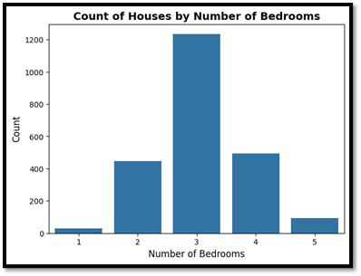
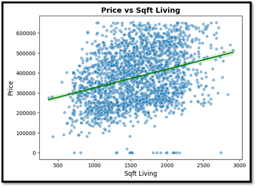
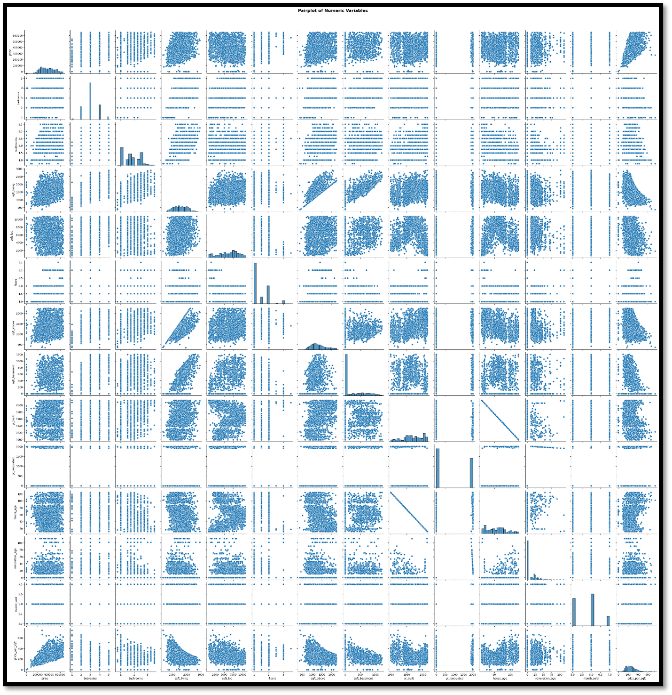

# 🏡 Housing Case Study – Python EDA Project

## 📌 Project Overview

This project performs **Exploratory Data Analysis (EDA) in Python** on a housing dataset to identify key factors influencing house prices. It covers **data cleaning, outlier treatment, feature engineering, univariate, bivariate, and multivariate analysis, hypothesis testing, and final recommendations** for better understanding of housing trends.

---

## 📂 Project Structure

```
REINFORCEMENT PROJECT - PYTHON
│
├── Documentation & Ppt
│   ├── Housing Case Study Ppt.pptx
│   └── Housing Case Study Document.pdf
│
├── Housing Dataset
│   ├── HouseCaseStudy.ipynb
│   ├── Housing Dataset Description.pdf
│   └── housing.csv
│
├── Visualizations
│   ├── Bivariate-1.png ... Bivariate-5.png
│   ├── Box Plot with Outliers.png
│   ├── Box Plot without Outliers.png
│   ├── MultiVariate-1.png, MultiVariate-2.png
│   ├── Univariate-1.png ... Univariate-4.png
```

---

## 🛠️ Technologies Used

* **Python** 🐍
* **Pandas, NumPy** → Data handling & preprocessing
* **Matplotlib, Seaborn** → Visualization & insights
* **Scipy/Statsmodels** → Statistical tests (Chi-square, hypothesis testing)
* **Jupyter Notebook** → Interactive analysis

---

## 🔍 Key Analysis Steps

1. **Data Understanding**

   * Dataset overview, data types, unique values.
2. **Data Cleaning**

   * Missing value treatment, encoding categorical features, outlier handling.
3. **Feature Engineering**

   * Created new features such as `house_age`, `renovation_age`, `price_per_sqft`, and `month_sold`.
4. **Univariate Analysis**

   * Distribution of prices, bedrooms, bathrooms, sqft metrics, and condition.
5. **Bivariate Analysis**

   * Relationship between house features (sqft, bathrooms, view, condition) and price.
6. **Multivariate Analysis**

   * Correlation heatmap, pair plots to observe joint relationships.
7. **Statistical Testing**

   * Chi-Square test (e.g., `view vs condition`) to test associations.
8. **Recommendations**

   * Insights derived for real-estate investors and policymakers.

---

## 📊 Sample Visualizations

### Univariate Analysis



### Bivariate Analysis



### Multivariate Heatmap



---

## 📌 Recommendations (Highlights)

* **Sqft\_living** and **sqft\_above** are the strongest predictors of price.
* Houses in **condition level 3** dominate the dataset.
* **Recently renovated houses** and **larger living areas** command higher prices.
* Outliers in **sqft\_lot and price** skew analysis — filtering improves insights.
* Feature engineering (e.g., `house_age`, `price_per_sqft`) adds more predictive power.

---

## 📑 Documentation

* Full project documentation and PowerPoint are available in the `Documentation & Ppt` folder.

---

## 🚀 How to Run

1. Clone this repo:

   ```bash
   git clone https://github.com/your-username/housing-case-study.git
   cd housing-case-study
   ```
2. Install dependencies:

   ```bash
   pip install -r requirements.txt
   ```
3. Open Jupyter Notebook:

   ```bash
   jupyter notebook Housing\ Dataset/HouseCaseStudy.ipynb
   ```

---

## ✨ Author

📌 Developed as part of a **Reinforcement Project (Python)** on EDA and data analytics.

---